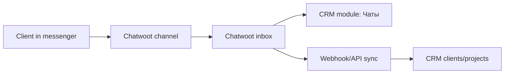

# Chatwoot chats module

## What we integrate

Chatwoot is an open-source customer support inbox. It can collect client messages from website chat, email, WhatsApp, Facebook, Instagram, SMS, Telegram, Line, TikTok and custom API channels.

In this CRM we use Chatwoot as a separate inbox service and connect it through the `Чаты` module.

References:

- https://github.com/chatwoot/chatwoot
- https://developers.chatwoot.com/self-hosted/deployment/docker
- https://www.chatwoot.com/features/channels/

## Architecture



## Why a separate service

Chatwoot is a Rails application with its own PostgreSQL database, Redis and Sidekiq worker. Keeping it separate avoids mixing Django CRM data and Chatwoot operational data, makes updates safer, and lets us connect messengers through Chatwoot's supported channels.

## Current CRM implementation

- Added `/chats` route.
- Added `Чаты` item to the CRM menu.
- Added backend settings endpoint `/api/chat-settings/`.
- Added `Система -> Чаты` settings card for admins.
- Added optional `docker-compose.chatwoot.yml` for TimeWeb self-hosting.
- Added `.env.chatwoot.example`.

If chat settings are empty, the module shows setup instructions. If an admin enables Chatwoot and saves a base URL, the module opens `<base_url>/app` inside the CRM page and also provides a button to open Chatwoot in a new tab.

If Chatwoot blocks iframe embedding in a browser, use the button first. The next integration step is to build a native CRM inbox UI over the Chatwoot REST API/webhooks.

## TimeWeb setup

1. Create DNS record:

```text
chats.cehcrm.ru A <server-ip>
```

2. Copy Chatwoot env file:

```bash
cd /opt/crm
cp .env.chatwoot.example .env.chatwoot
```

3. Edit `.env.chatwoot`:

```env
CHATWOOT_FRONTEND_URL=https://chats.cehcrm.ru
CHATWOOT_SECRET_KEY_BASE=<long-random-secret>
CHATWOOT_POSTGRES_PASSWORD=<strong-password>
```

Generate a secret:

```bash
openssl rand -hex 64
```

4. Add a Caddy site block for Chatwoot.

Edit `/opt/crm/docker/caddy/Caddyfile` and add:

```caddy
chats.cehcrm.ru {
    encode zstd gzip
    reverse_proxy chatwoot:3000
}
```

Keep the existing `cehcrm.ru` block.

5. Start Chatwoot:

The main CRM compose must already be running because Chatwoot joins its `crm_default` Docker network so Caddy can proxy `chatwoot:3000`.

```bash
docker compose -p crm-chatwoot --env-file .env.chatwoot -f docker-compose.chatwoot.yml up -d
```

6. Restart CRM Caddy so it picks up the new site block:

```bash
docker compose -p crm --env-file .env -f docker-compose.prod.yml up -d --force-recreate caddy
```

7. Add Chatwoot URL in CRM settings:

Open `Система -> Чаты`, enable the module and set:

```text
Chatwoot URL: https://chats.cehcrm.ru
Inbox name: Основные чаты
Account ID: <optional Chatwoot account id>
API access token: <optional token for future webhooks/API sync>
```

No frontend rebuild is needed after changing this URL because the CRM reads it from backend settings.

## Messenger connection order

Start with:

- Website chat widget.
- Telegram.
- Email.

Then add:

- WhatsApp through an approved provider.
- Instagram/Facebook if the account has Meta Business access.

## CRM sync plan

1. Contact matching:

Chatwoot contact phone/email should match CRM client phone/email.

2. Client card link:

Store CRM `client_id` and latest `project_id` in Chatwoot contact custom attributes.

3. Webhook receiver:

Add Django endpoint for Chatwoot webhooks:

```text
POST /api/chatwoot/webhook/
```

Events to process:

- contact_created
- contact_updated
- conversation_created
- message_created

4. CRM UI:

After webhooks, the CRM can show:

- unread count per client;
- latest message in client/project card;
- quick link from project to Chatwoot conversation.

5. AI assistant:

After webhook sync, include latest client messages in the CRM memory snapshot so the assistant can answer questions like:

```text
что последний раз написал клиент по проекту?
```

## Notes

- Do not store Chatwoot data inside the CRM database in the first stage.
- Keep Chatwoot backups separate from CRM backups.
- Use a separate subdomain for Chatwoot.
- Keep the CRM chat settings disabled until Chatwoot is reachable over HTTPS.
- For SaaS mode with several independent companies, add a workspace/tenant model and attach users, clients, projects, finances and chat settings to that workspace. The current setting is one CRM workspace/inbox per deployment.
